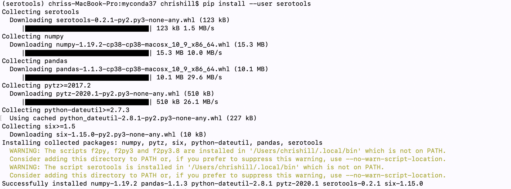

# Q. What is a way to install serotools? ( https://joss.theoj.org/papers/10.21105/joss.02556 ). 

Serotools appears to be command ine program that invokes Python, but is not run from within a Python shell. See for example https://serotools.readthedocs.io/en/latest/usage.html#usage

1. install isolated Python via conda.

   ```
     curl https://repo.anaconda.com/archive/Anaconda3-2020.07-MacOSX-x86_64.sh > Anaconda3-2020.07-MacOSX-x86_64.sh
     chmod +x Anaconda3-2020.07-MacOSX-x86_64.sh
     ./Anaconda3-2020.07-MacOSX-x86_64.sh -p conda3
   ```
   
2.  check Python version in the new ```base``` environment

    ```
     source conda3/bin/activate
     python -V
    ```
  
 3.  now create and activate an environment for serotools
 
  ```
   conda create -n serotools python=3.8
   conda activate serotools 
  ```
  
  
  
 4. now install serotools from within the conda environment 
  ```
    pip install --user serotools
  ```
   Note - this stage installs serotools in a top-level ```.local/bin``` directory (see image)
   
  
  
  
 5. now run serotools. This uses an unusual location to run the command from. Ideally the ```pip install``` for serotools
    should install 
  ```
   ~/.local/bin/serotools query -s 'Paratyphi A'
  ```
  
  ```
    Input	Name	Formula	Match
    Paratyphi A	Paratyphi A	I [1],2,12:a:[1,5]	exact
  ```


6. as an alternate to pip 
   ```
     git clone https://github.com/CFSAN-Biostatistics/serotools
     cd serotools
     ./setup.py build
     ./setup.py install
   ```
