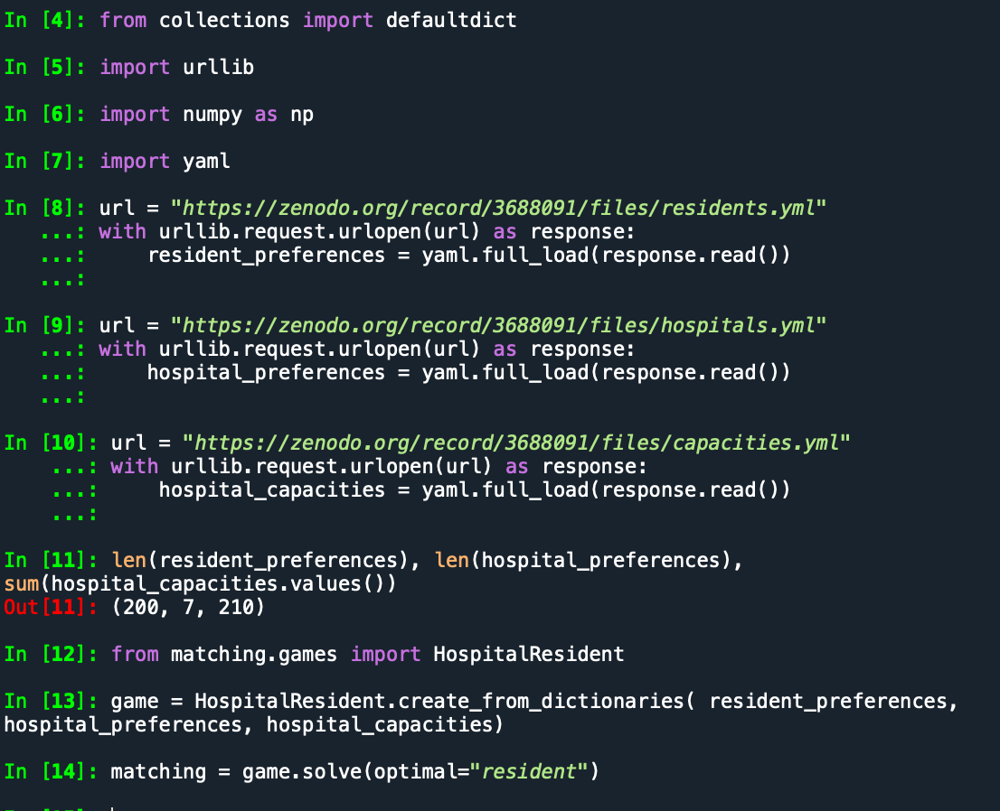

# Q. How can we get Spyder to recognize matching (  https://github.com/daffidwilde/matching, https://joss.theoj.org/papers/10.21105/joss.02169 )

## problem - after installing matching per github instructions the examples run in python "shell", but Spyder python environment gives

```
 ImportError: cannot import name 'Player' from 'matching' (/Users/swathisenthil/matching.py)

```


## Try a clean conda environment

```
conda create -n matching
conda activate matching
```

```
conda install python
python -m pip install matching
conda install spyder
conda install numpy
conda install yaml
```

```
spyder
```


